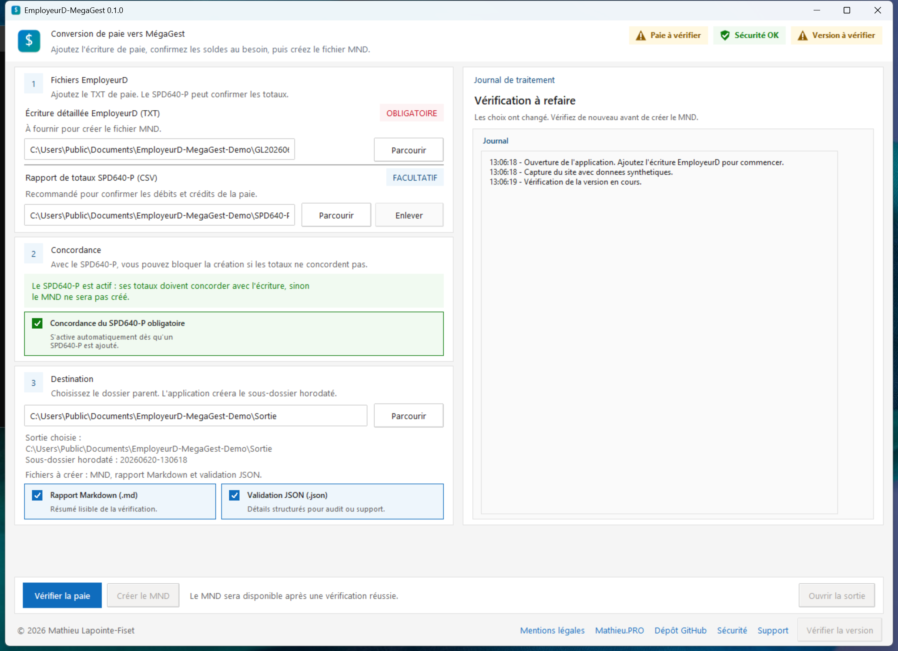

# EmployeurD-MegaGest

<p align="center">
  <strong>Créer un fichier MND pour MégaGest à partir d'une écriture détaillée EmployeurD.</strong>
</p>



<p align="center">
  <a href="https://github.com/sponsors/MathieuLF"><strong>Sponsor GitHub</strong></a>
</p>

## En bref

EmployeurD-MegaGest est un utilitaire Windows qui prépare un fichier `.mnd` pour MégaGest à partir d'une écriture détaillée EmployeurD au format TXT.

Le PDF original du grand détail de l'écriture GL peut être ajouté pour confirmer les totaux et les montants par compte avant la création du MND. Il doit venir d'EmployeurD, sans numérisation ni modification.

## Utiliser l'application

1. Télécharger la dernière version depuis [GitHub Releases](https://github.com/MathieuLF/employeurd-coda-megagest/releases).
2. Extraire le fichier zip.
3. Ouvrir `EmployeurD-MegaGest.exe`.
4. Ajouter l'écriture EmployeurD TXT.
5. Ajouter le PDF du grand détail GL au besoin.
6. Vérifier la paie, puis créer le MND si tout est conforme.

### Première ouverture sur Windows

Windows SmartScreen peut afficher un avertissement de sécurité au premier lancement. C'est attendu : l'application est publique et vérifiable, mais elle n'est pas signée numériquement.

Si le fichier provient bien de la page officielle GitHub Releases, cliquez sur `Informations complémentaires`, puis sur `Exécuter quand même`.

## Pages utiles

- [Site de présentation](https://mathieulf.github.io/employeurd-coda-megagest/)
- [Guide rapide](docs/guide_utilisateur.md)
- [Formats des fichiers](docs/formats.md)
- [Sécurité](SECURITY.md)
- [Support](SUPPORT.md)
- [Sponsor GitHub](https://github.com/sponsors/MathieuLF)
- [Mentions légales](docs/mentions_legales.md)
- [Licence MIT](LICENSE)

## Développement

```powershell
python -m pip install -e .
python scripts/agent_validate.py
```

La validation courante ne demande ni base de données, ni serveur, ni clé secrète.

## Important

Ne publiez jamais de fichier de paie réel dans GitHub, dans un billet public ou dans un service externe.

EmployeurD, PG Solutions, MégaGest et les autres marques citées appartiennent à leurs propriétaires respectifs.
